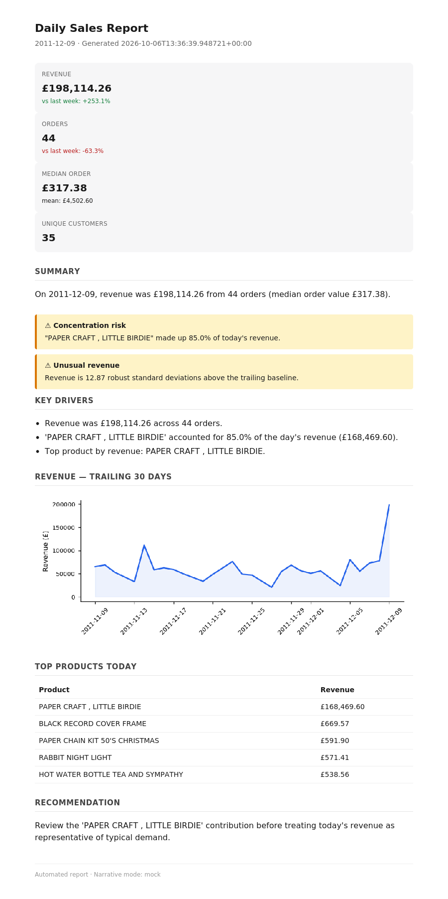
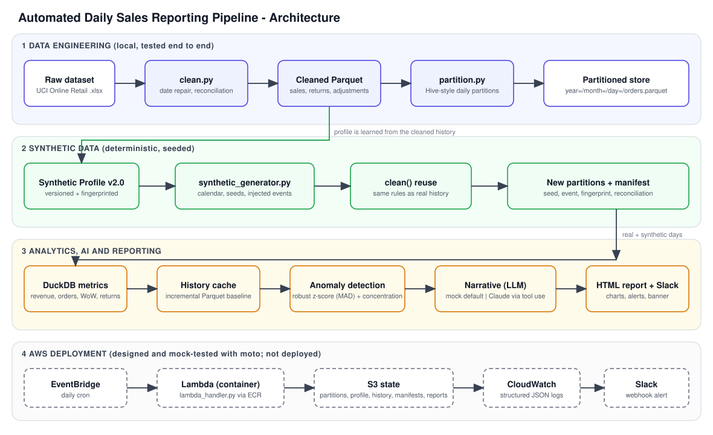
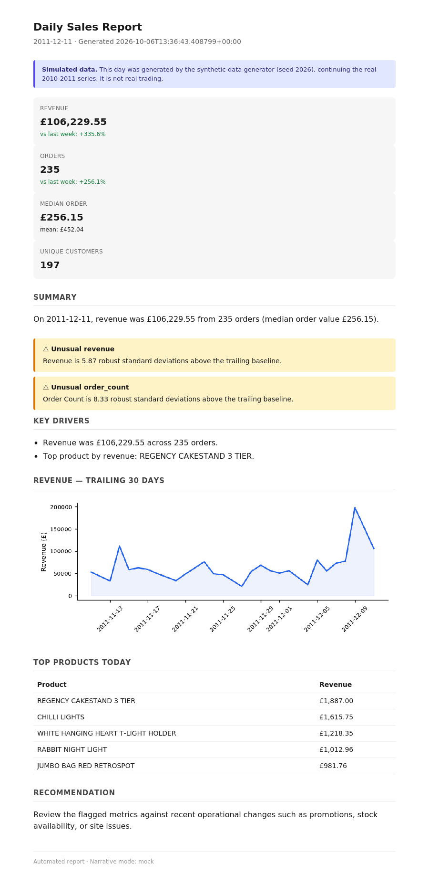

# Automated Daily Sales Reporting Pipeline

An end-to-end data and AI pipeline that turns raw e-commerce transactions into a daily executive
report: it **cleans** messy data with full row reconciliation, **detects anomalies** statistically,
has an **LLM explain** the pre-computed numbers in plain English, renders a self-contained **HTML
report**, and delivers it to **Slack**. A calibrated **synthetic-data generator** continues the real
2010-2011 history indefinitely, so the automation can run every day without a live data feed.

<p align="center">
  
</p>

*A report generated by this pipeline from the real UCI Online Retail data. One £168k line item made up
85% of the day's revenue, and the pipeline flagged it (concentration risk, plus revenue 12.87 robust
standard deviations above baseline). More in [Sample outputs](#sample-outputs).*

## What it demonstrates

| Area | What is in the repository |
|---|---|
| **Data engineering** | Cleaning with an exact row-reconciliation check, Hive-style Parquet partitioning, DuckDB analytics over partitions, an incremental history cache |
| **Data quality** | Every one of 541,909 raw rows lands in exactly one labelled bucket; a hidden Excel date-corruption bug was found and fixed at the source |
| **Analytics** | Robust anomaly detection (median/MAD), concentration-risk and return-rate checks, week-over-week and month-over-month comparisons |
| **AI** | LLM narrative with forced structured output, no raw data and no arithmetic delegated to the model, a free deterministic mock mode, per-run cost tracking |
| **Automation and cloud** | Container-based AWS Lambda handler with S3 state sync, scheduled daily run, Slack delivery, structured logs, scripted deployment (see [status](#aws-and-automation-status)) |
| **Reliability** | Deterministic seeded generation, versioned and fingerprinted profile, manifests for every synthetic day, failed runs leave no partial output |
| **Testing** | 132 automated tests, including moto-mocked S3 state across cold starts and failure-path tests |

## Architecture

<p align="center">
  
</p>

1. **Data engineering** - `clean.py` repairs and reconciles the raw workbook, `partition.py` writes one
   Parquet partition per trading day.
2. **Synthetic data** - the generator samples new days from **Synthetic Profile v2.0** (a versioned,
   fingerprinted statistical profile learned from the real history) and pushes them through the same
   `clean()` rules as real data.
3. **Analytics and AI** - DuckDB metrics, robust anomaly detection, then the narrative layer and the
   HTML report. The LLM only ever sees pre-computed numbers.
4. **AWS** - a scheduled Lambda container syncs state from S3, advances one trading day, reports, and
   uploads the new state only after the report succeeds.

## Measured results

All figures come from runs on the real dataset (UCI Online Retail, 2010-12-01 to 2011-12-09, 305
trading days).

| Check | Result |
|---|---|
| Row reconciliation | 541,909 input rows = 527,789 clean sales + 9,288 cancellations + 2,326 non-product adjustments + 1,052 data errors + 1,454 missing descriptions. Zero rows unaccounted for |
| Excel date corruption | 232,959 swapped date cells repaired; the xlsx and an independent CSV release now produce **identical** cleaned data |
| Revenue cross-check | £10,272,118.87 recomputed independently from the raw workbook matches the pipeline to the penny |
| Anomaly detection | 27 of 305 days flagged (8.9%); the three detectable injected events were flagged 8/8 times |
| History baseline | Recomputing all 305 days one by one took 127 s; the batched cache builds it in 0.3 s |
| Mean vs median | On 2011-12-09 the mean order value was £4,502.60 against a median of £317.38, which is why the report shows the median |

## Quick start

Requires Python 3.12 or newer. The suite runs on Python 3.12 (Linux). A separate Windows run on Python 3.14
passed all 113 tests that existed before `test_narrative.py` was added.

```bash
# 1. Install
python -m venv .venv
source .venv/bin/activate          # Windows PowerShell: .venv\Scripts\Activate.ps1
pip install -r requirements-dev.txt

# 2. Add the raw data (not in the repository, see data/README.md)
#    Put "Online Retail.xlsx" from the UCI repository in data/raw/

# 3. Build everything from the raw file
python pipeline/clean.py               # raw -> data/cleaned  (+ quality report)
python pipeline/partition.py           # cleaned -> daily partitions
python pipeline/synthetic_profile.py   # Synthetic Profile v2.0
python pipeline/history_cache.py       # anomaly baseline cache

# 4. Report on a real day (mock narrative: free, no API key)
python pipeline/run_report.py 2011-12-09        # writes reports/report_2011-12-09.html

# 5. Generate the next synthetic trading day, then report on it
python pipeline/synthetic_generator.py --seed 2026 --event demand_spike
python pipeline/run_report.py 2011-12-11
```

The synthetic day in step 5 is exactly the one shown in [Sample outputs](#sample-outputs): the same
seed and date always produce byte-identical data.

### Configuration

Copy `.env.example` to `.env` (git-ignored). Everything works with the defaults; a real LLM, Slack and
AWS are all optional.

| Variable | Purpose | Default |
|---|---|---|
| `USE_MOCK_LLM` | `true` uses a deterministic template, `false` calls Claude | `true` |
| `ANTHROPIC_API_KEY` | Needed only when `USE_MOCK_LLM=false` | unset |
| `ANTHROPIC_MODEL`, `ANTHROPIC_INPUT_PRICE_PER_MTOK`, `ANTHROPIC_OUTPUT_PRICE_PER_MTOK` | Model and per-token prices used for the cost estimate; verify both before live use | `claude-sonnet-4-5`, 3.00, 15.00 |
| `BUCKET_NAME` | S3 bucket for Lambda state | required in Lambda |
| `SLACK_WEBHOOK_URL` | If unset, Slack delivery is skipped and the run still succeeds | unset |
| `GENERATOR_SEED`, `GENERATOR_EVENT` | Force a reproducible synthetic day | random seed, logged |
| `WORK_DIR` | Lambda staging folder | system temp |

## Synthetic data and injected events

The generator never touches real history. Each run advances to the next trading day (Saturdays are skipped as learned from the data,
and the year-end closure comes from an explicit rule in `config/data_rules.py`), samples orders, customers, products, quantities
and cancellations from the profile, and writes partitions plus a manifest recording the seed, event,
profile fingerprint and cleaning reconciliation, which is enough to replay or debug any day.

| Event | What is injected | Detector expectation |
|---|---|---|
| `bulk_order` | One cheap line worth more than 1.2x the rest of the day | Detectable (concentration risk) |
| `demand_spike` | Revenue 4.5 to 6 robust sigmas above the median | Detectable (revenue) |
| `return_spike` | 70-100% of orders also get a cancellation | Detectable (return rate) |
| `demand_drop` | Volume cut to its physical floor | **Not detectable by design** (see below) |
| `promo_uplift` | Ordinary 1.3-1.6x volume increase | Not guaranteed (flagged in 4 of 12 seeds) |

`demand_drop` cannot be flagged at the detector's threshold on this data: order count cannot fall below
1, so the most extreme drop reaches only |z| = (62 - 1) / 20.76 = 2.94, under the 3.5 threshold. This is
a property of the data's dispersion rather than a calibration bug, and is documented rather than hidden.

## The AI layer

- **The model explains, it does not calculate.** All metrics are computed in DuckDB and Python first.
  The model receives only those numbers (never raw transactions) and its system prompt forbids
  inventing or changing figures.
- **Structured output.** The call forces a tool-use schema (`summary`, `key_drivers`,
  `anomaly_explanation`, `recommendation`); a response without the tool call or with a missing field is
  rejected with a clear error.
- **Free by default.** `USE_MOCK_LLM=true` produces a deterministic narrative grounded in the same
  numbers, so the whole pipeline, tests and CI run with no key and no cost.
- **Cost tracking.** Token usage and an estimated cost are computed and logged for every live run.
- **Tested without the API.** The live path is covered by tests that inject a stub client
  (forced tool choice, incomplete responses, missing key or SDK, cost arithmetic). It has not been run
  against the real API in this repository.

## AWS and automation status

`lambda_handler.py` is a container-image Lambda: it downloads state from S3, advances one trading day
(or regenerates an explicit `{"target_date": "YYYY-MM-DD"}` without moving the cursor), runs the report,
and **uploads the new state only after the report succeeds**. It logs structured JSON for CloudWatch and
delivers to Slack if configured. `Dockerfile` builds it on the Lambda Python 3.12 base image, and
[`infra/deploy.md`](infra/deploy.md) contains the scripted S3, IAM, ECR, Lambda and scheduler steps.

**Status: designed, containerised and tested, but not deployed.** The development environment had no AWS
credentials or Docker daemon. S3 behaviour is verified with `moto` (including cold starts that rely only
on persisted S3 state), the pinned Lambda dependencies were installed and run in an isolated Python 3.12
environment, and the deployment guide is written against the final code. Nothing here claims a running
cloud deployment.

## Testing

```bash
python -m pytest -q                     # full suite (needs data/raw, see above)
python -m pytest -q tests/test_clean.py tests/test_narrative.py   # no dataset needed
```

| File | Tests | Covers |
|---|---|---|
| `test_clean.py` | 12 | Excel date repair (datetime vs text cells, every year, real `.xlsx` round trip), row reconciliation, audit of dropped rows, one stable schema |
| `test_narrative.py` | 19 | Mock determinism and grounding, forced tool use, response validation, cost maths, missing key or SDK |
| `test_synthetic_generator.py` | 81 | Schema parity with real data, trading calendar, reproducibility, invoice uniqueness, event behaviour, profile validation, failure paths |
| `test_synthetic_pipeline_integration.py` | 13 | The Day 1-3 pipeline consuming synthetic partitions, week-over-week continuity |
| `test_lambda_handler.py` | 7 | S3 state persistence across invocations and cold starts, explicit-date regeneration, no backslash S3 keys |

Last full run: `132 passed in 279.26s (Python 3.12, Linux)`. The CI workflow in `.github/workflows/ci.yml` runs dependency, static and
dataset-free tests on every push; the dataset-dependent tests run locally because the data is not in
the repository.

## Sample outputs

The [`docs/samples/`](docs/samples) folder holds real outputs of this pipeline:

| File | What it is |
|---|---|
| [`report_2011-12-09_real.html`](docs/samples/report_2011-12-09_real.html) | Full report for a real day |
| [`report_2011-12-11_synthetic_demand_spike.html`](docs/samples/report_2011-12-11_synthetic_demand_spike.html) | Synthetic day (`--seed 2026 --event demand_spike`), with the simulated-data banner |
| [`synthetic_manifest_2011-12-11.json`](docs/samples/synthetic_manifest_2011-12-11.json) | Manifest that makes the synthetic day reproducible |
| [`data_quality_report.json`](docs/samples/data_quality_report.json) | Row reconciliation for the full dataset |
| [`metrics_2011-12-09.json`](docs/samples/metrics_2011-12-09.json), [`anomalies_2011-12-09.json`](docs/samples/anomalies_2011-12-09.json), [`narrative_2011-12-09_mock.json`](docs/samples/narrative_2011-12-09_mock.json) | The three stages that feed the report |

<p align="center">
  
</p>

## Project structure

```
pipeline/
  paths.py                  Single source of truth for the data/ layout
  clean.py                  Raw xlsx/csv -> reconciled, labelled buckets, Excel date repair
  partition.py              Hive-style daily Parquet partitions
  metrics.py                Deterministic DuckDB metrics (no LLM maths)
  history_cache.py          Incremental baseline cache for anomaly detection
  anomaly_detection.py      Robust z-score, concentration risk, return rate
  narrative.py              LLM narrative: structured output, mock mode, cost tracking
  report.py                 Self-contained HTML report
  run_report.py             Orchestration entry point
  synthetic_profile.py      Synthetic Profile v2.0 (validated, fingerprinted)
  synthetic_generator.py    Seeded day generation with five ground-truth events
config/data_rules.py        Cancellation, non-product and year-end rules
lambda_handler.py           S3 sync, generation, report, Slack delivery
infra/                      deploy.md (AWS steps) and seed_s3.py
tests/                      132 tests
docs/                       Architecture diagram, screenshots, sample outputs, engineering log
data/                       Git-ignored; see data/README.md
```

## Known limitations

- `demand_drop` is undetectable at the current threshold on this data; `promo_uplift` is only sometimes
  flagged. Both are documented behaviour. Fixing them means redesigning the detector (asymmetric or
  log-scale thresholds).
- The dataset is one year of a UK gift retailer. Synthetic days are statistically calibrated to it, not
  real trading, and are always labelled as simulated in the report and Slack message.
- The AWS deployment and the live Anthropic call have not been run; see the status sections above.

## More documentation

- [`PORTFOLIO.md`](PORTFOLIO.md) - case study: problem, decisions, bugs found and what they taught
- [`docs/ENGINEERING_LOG.md`](docs/ENGINEERING_LOG.md) - detailed build history and design rationale
- [`infra/deploy.md`](infra/deploy.md) - AWS deployment guide
- [`data/README.md`](data/README.md) - dataset and data layout

## Data attribution

Online Retail dataset: Chen, D. (2015). *UCI Machine Learning Repository*,
<https://archive.ics.uci.edu/dataset/352/online+retail>, licensed CC BY 4.0.
